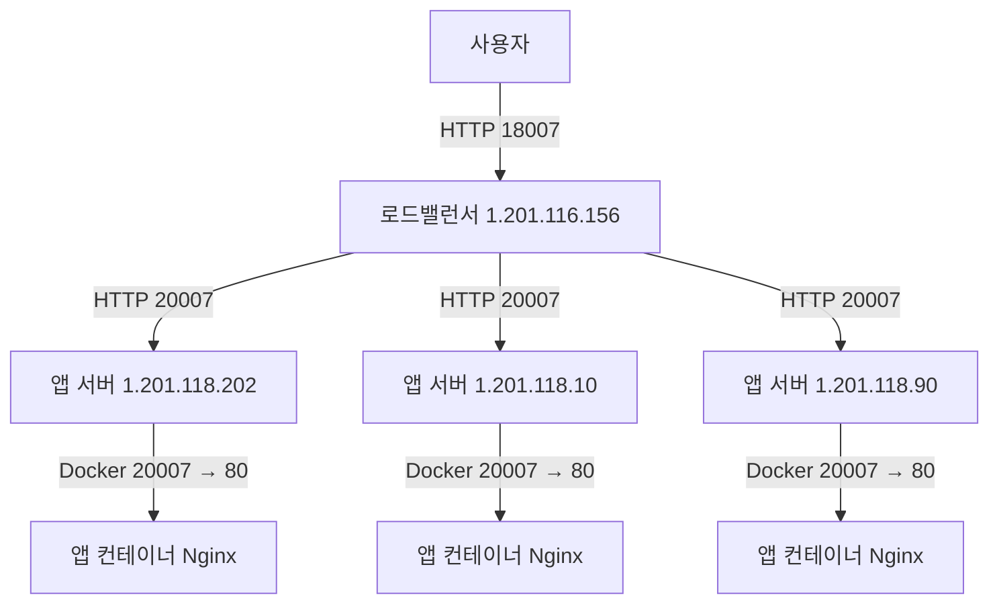

> 문서 역할: Week1 당시의 파일 구성과 Jenkins·Ansible 배포 흐름을 설명하는 학습 기록이다.

# Prj-week1 — Jenkins와 Ansible 배포 흐름

이 문서는 현재 저장소의 코드를 기준으로, 작은 앱을 만드는 단계부터 Jenkins가 빌드·배포·검증하는 단계까지 설명한다. 예시의 Jenkins 빌드 번호는 `42`이며, 이미지 태그는 `42`, 앱의 버전 응답은 `v42`로 표기한다.

| 순서 | 필요한 것 | 작성할 파일 |
| --- | --- | --- |
| 1 | 정상 응답하는 작은 앱 | `app/default.conf.template` |
| 2 | 앱을 같은 환경에서 실행할 이미지 | `Dockerfile` |
| 3 | 배포 대상 목록 | `ansible/inventory.ini` |
| 4 | 반복할 서버 배포 작업 | `ansible/roles/app/defaults/main.yml`, `ansible/roles/app/tasks/main.yml` |
| 5 | 대상 그룹과 배포 작업 연결 | `ansible/playbook/deploy.yml` |
| 6 | 사용자에게 제공할 단일 접속 주소 | `ansible/roles/nginx_lb/`, `ansible/playbook/nginx.yml` |
| 7 | 배포 후 경유 검사 | `ansible/playbook/verify.yml` |
| 8 | SSH 호스트 키 준비 및 전체 과정 자동 실행 | `ansible/playbook/prepare_ssh.yml`, `Jenkinsfile` |

## 1. 정상 응답하는 작은 앱 — app/default.conf.template

[app/default.conf.template](../app/default.conf.template)은 앱 컨테이너 안에서 실행되는 Nginx의 설정 원본이다. 이 프로젝트의 앱은 별도 웹 프레임워크 없이 Nginx가 직접 문자열을 응답하는 실습용 앱이다.

| 요청 경로 | HTTP 상태 | 응답 본문 | 목적 |
| --- | --- | --- | --- |
| `/health` | `200` | `OK`와 줄바꿈 | 앱 응답 확인 |
| `/version` | `200` | `${APP_VERSION}`의 값과 줄바꿈 | 실행한 배포 버전 확인 |
| `/` 및 위 두 경로 외의 경로 | `200` | `Sohyeon Jenkins + Ansible CI/CD`와 줄바꿈 | 기본 응답 |

`listen 80`은 **컨테이너 내부의 80번 포트**에서 요청을 받는다는 뜻이다. 앱 서버 외부에 공개할 포트는 이 파일이 아니라 배포 시 `docker run -p`에서 지정한다.

`${APP_VERSION}`은 Ansible의 Jinja2 변수가 아니라 컨테이너 환경변수다. 예를 들어 컨테이너를 `-e APP_VERSION=v42`로 실행하면 기반 Nginx 이미지의 시작 처리에서 이 값을 치환한 설정을 만들고, `/version` 요청에 `v42`를 응답한다.

```text
default.conf.template
  → 컨테이너 시작 시 APP_VERSION 환경변수 치환
  → /etc/nginx/conf.d/default.conf 생성
  → Nginx가 컨테이너의 80번 포트에서 응답
```

`/health`는 고정 문자열을 반환한다. 데이터베이스나 외부 서비스까지 확인하는 상태 검사는 아니다.

## 2. 앱을 같은 환경에서 실행할 이미지 — Dockerfile

[Dockerfile](../Dockerfile)은 위 설정을 포함한 Docker 이미지를 만든다.

```dockerfile
FROM nginx:alpine
COPY app/default.conf.template /etc/nginx/templates/default.conf.template
EXPOSE 80
```

| 명령 | 역할 |
| --- | --- |
| `FROM nginx:alpine` | Nginx와 컨테이너 시작 스크립트가 포함된 기반 이미지 사용 |
| `COPY ...` | 앱 설정 템플릿을 이미지 안의 `/etc/nginx/templates/`에 포함 |
| `EXPOSE 80` | 컨테이너가 사용하는 포트를 명시. 호스트 포트를 실제로 열지는 않음 |

이미지 빌드 시에는 템플릿을 복사한다. 버전 치환은 **컨테이너 실행 시** 일어나므로 Jenkins의 Test와 실제 서버 배포에서 각각 `APP_VERSION`을 전달한다.

```text
Jenkins Build
  → docker build -t sohyeon-cicd-app:42 .
  → Jenkins가 접근하는 Docker daemon에 이미지 생성
  → Test에서 해당 이미지 실행
  → Prepare Artifact에서 해당 이미지를 tar로 저장
  → Ansible이 같은 이미지를 앱 서버 3대에 전달
```

현재는 이미지 registry에 push/pull하지 않고 tar 파일로 전달한다.

## 3. 배포 대상 목록 — ansible/inventory.ini

[ansible/inventory.ini](../ansible/inventory.ini)는 Ansible이 관리할 서버와 그룹을 정의한다.

| 그룹 | inventory의 호스트 이름 | 실제 접속 IP | 역할 |
| --- | --- | --- | --- |
| `app_servers` | `sohyeon-app1` | `1.201.118.202` | 앱 컨테이너 실행 |
| `app_servers` | `sohyeon-app2` | `1.201.118.10` | 앱 컨테이너 실행 |
| `app_servers` | `sohyeon-app3` | `1.201.118.90` | 앱 컨테이너 실행 |
| `load_balancer` | `sohyeon-lb` | `1.201.116.156` | Nginx로 앱 서버에 요청 분산 |

`sohyeon-app1` 등은 Ansible에서 사용하는 별칭이다. `ansible_host`가 실제 접속 주소를 지정한다.

Jenkins는 다음 옵션으로 inventory를 사용한다.

```sh
ansible-playbook -i ansible/inventory.ini ansible/playbook/deploy.yml ...
```

inventory에는 SSH 사용자명이나 개인 키가 없다. Jenkins credential에서 읽은 값을 `ANSIBLE_REMOTE_USER`, `ANSIBLE_PRIVATE_KEY_FILE`로 전달한다. 별도 SSH 포트 지정은 없으므로 기본 설정 기준 22번 포트를 사용한다.

**서버 관리용 SSH 연결과 앱 요청용 HTTP 연결은 별개다.**

| 연결 | 목적 | 포트 |
| --- | --- | --- |
| Jenkins agent → 각 서버 | Ansible 작업 실행·파일 전송 | SSH 기본 `22` |
| 사용자 → 로드밸런서 | 서비스 요청 | HTTP `18007` |
| 로드밸런서 → 앱 서버 | 요청 전달 | HTTP `20007` |
| 앱 서버 호스트 → 앱 컨테이너 | Docker 포트 매핑 | `20007 → 80` |

## 4. 반복할 서버 배포 작업 — app role

role은 관련 변수와 작업을 묶는 Ansible의 구성 단위다. `app` role은 **이미 만들어진 이미지를 앱 서버에 배포**한다. 이미지 빌드와 임시 컨테이너 테스트는 이 role에 포함돼 있지 않다.

### 4-1. defaults/main.yml: 배포 기본값

[ansible/roles/app/defaults/main.yml](../ansible/roles/app/defaults/main.yml)은 다음 기본값을 제공한다.

| 변수 | 기본값 | 용도 |
| --- | --- | --- |
| `app_name` | `sohyeon-cicd-app` | 서비스 컨테이너 이름 및 임시 tar 파일 이름 |
| `image_name` | `sohyeon-cicd-app` | 실행할 이미지 이름 |
| `image_tag` | `latest` | 실행할 이미지 태그. Jenkins가 빌드 번호로 덮어씀 |
| `image_tar` | 빈 문자열 | Jenkins agent에 저장된 이미지 tar 경로. 실행 시 전달 필요 |
| `host_port` | `20007` | 앱 서버에서 공개할 포트 |
| `container_port` | `80` | 앱 컨테이너 내부 포트 |

Jenkins는 `-e` 옵션으로 `image_name`, `image_tag`, `image_tar`를 전달한다. 예를 들어 `image_tag=42`가 기본값 `latest`보다 우선한다.

### 4-2. tasks/main.yml: 각 앱 서버에서 실행할 작업

[ansible/roles/app/tasks/main.yml](../ansible/roles/app/tasks/main.yml)의 task는 아래 순서로 실행된다. `copy`는 Jenkins agent의 파일을 원격 서버로 전송하고, Docker 명령과 `uri` 검사는 대상 앱 서버에서 실행된다.

| 순서 | 코드의 task 이름 | 동작과 결과 |
| --- | --- | --- |
| 1 | `Validate deployment variables` | `image_tar`, `image_tag`가 빈 값이 아닌지 assert. 파일 존재 여부나 이미지 유효성까지 검사하지는 않음 |
| 2 | `Copy Sohyeon Docker image` | agent의 `image_tar`를 앱 서버의 `/tmp/sohyeon-cicd-app-42.tar`로 복사. 파일 권한 `0644` |
| 3 | `Load Sohyeon Docker image` | 권한을 상승해 `docker load -i ...` 실행. 결과를 `docker_load_result`에 저장하고 출력으로 변경 여부 표시 |
| 4 | `Check existing Sohyeon container` | 이름이 정확히 `app_name`인 기존 컨테이너의 ID 조회. 중지된 컨테이너도 포함. 결과를 `existing_container`에 저장 |
| 5 | `Remove existing Sohyeon container` | 앞에서 ID가 조회됐을 때만 `docker rm -f`로 기존 컨테이너 제거 |
| 6 | `Run Sohyeon application container` | 새 이미지로 서비스 컨테이너 실행. 버전 환경변수, 포트 매핑, 재시작 정책 지정 |
| 7 | `Wait for Sohyeon application health check` | 앱 서버 자신의 `http://127.0.0.1:20007/health` 검사. HTTP `200`과 본문 `OK`를 모두 요구하며 `retries: 10`, `delay: 2`로 재시도 설정 |
| 8 | `Check deployed application version` | 앱 서버 자신의 `http://127.0.0.1:20007/version` 요청. HTTP `200`을 요구하고 응답 저장 |
| 9 | `Verify deployed application version` | 응답의 앞뒤 공백을 제거한 값이 `v42`인지 assert |
| 10 | `Remove temporary Docker image tar` | 앱 서버에 복사한 `/tmp/sohyeon-cicd-app-42.tar` 삭제 |

6번 task가 실행하는 명령은 기본값과 예시 버전 기준 다음과 같다.

```sh
docker run -d \
  --name sohyeon-cicd-app \
  --restart unless-stopped \
  -e APP_VERSION=v42 \
  -p 20007:80 \
  sohyeon-cicd-app:42
```

`-p 20007:80` 때문에 앱 서버의 20007번 포트로 들어온 요청이 컨테이너의 80번 포트로 전달된다.

```text
각 앱 서버에서 Ansible uri 실행
  → http://127.0.0.1:20007/health 또는 /version
  → 해당 서버의 Docker 포트 매핑
  → 컨테이너:80
  → 앱 Nginx가 OK 또는 v42 응답
```

이 검사는 로드밸런서를 거치지 않는다. 서버마다 새 컨테이너가 실행됐고, 호스트의 공개 포트를 통해 원하는 버전이 응답하는지 확인한다.

현재 구현은 같은 버전으로 다시 배포해도 기존 컨테이너를 제거하고 새로 만든다. 중간 task가 실패한 호스트에서는 뒤의 일반 task가 진행되지 않으므로, 마지막 tar 삭제가 항상 보장되는 것은 아니다. 자동 롤백도 정의돼 있지 않다.

## 5. 대상 그룹과 배포 작업 연결 — ansible/playbook/deploy.yml

[ansible/playbook/deploy.yml](../ansible/playbook/deploy.yml)은 “어느 서버에 어떤 role을 실행할 것인가”를 연결한다.

```yaml
- name: Deploy Sohyeon CI/CD application
  hosts: app_servers
  gather_facts: false
  roles:
    - role: "{{ playbook_dir }}/../roles/app"
```

| 항목 | 의미 |
| --- | --- |
| `hosts: app_servers` | inventory의 앱 서버 3대를 대상으로 지정 |
| `gather_facts: false` | 시작 시 시스템 정보 자동 수집 생략 |
| `role: "{{ playbook_dir }}/../roles/app"` | 플레이북 위치를 기준으로 `ansible/roles/app`의 기본 변수와 `tasks/main.yml`을 사용 |

```text
Jenkins Deploy
  → agent에서 ansible-playbook 실행
  → inventory의 app_servers 선택
  → SSH로 앱 서버 3대에 접속
  → 각 서버에 app role 적용
     tar 복사 → 이미지 load → 기존 컨테이너 제거 → 새 컨테이너 실행
     → 각 서버의 127.0.0.1:20007/health
     → 각 서버의 127.0.0.1:20007/version
     → 임시 tar 삭제
```

이 playbook에는 `serial` 설정이 없다. 기본 실행 전략에서는 각 task를 여러 대상 호스트에 수행하고 다음 task로 넘어가므로, “app1의 배포 전체 완료 → app2의 배포 전체 완료”라는 순차 배포를 보장하지 않는다. 무중단 롤링 배포도 구현돼 있지 않다.

`deploy.yml`은 `nginx.yml`이나 `verify.yml`을 호출하지 않는다. 현재는 Jenkins가 각각의 stage에서 별도로 실행한다.

## 6. 사용자에게 제공할 단일 접속 주소 — nginx_lb role과 nginx.yml

**`nginx_lb` role은 “사용자가 들어오는 주소에서 앱 서버까지 요청을 어떻게 전달할지”를 로드밸런서 Nginx에 설정하는 작업이다.** `lb`는 load balancer의 약자다. 앱 서버에 앱을 실행한 뒤에는 사용자 요청이 그 앱까지 도달할 경로도 필요하다. 이 프로젝트에서는 그 경로를 로드밸런서의 Nginx로 구성한다.

세 구성 요소는 다음처럼 역할을 나눈다.

| 구성 요소 | 담당하는 일 | 실행 후 남는 결과 |
| --- | --- | --- |
| `app` role | 앱 서버 3대에 이미지를 전달하고 컨테이너 실행 | 각 앱 서버의 `20007` 포트에서 응답하는 앱 |
| `nginx_lb` role | 로드밸런서에 수신 포트와 요청 전달 대상 설정 | `18007`로 받은 요청을 앱 서버의 `20007`로 전달하는 Nginx 설정 |
| `verify.yml` | 설정된 Nginx 경로로 요청을 보내 응답 검사 | 검사 성공 또는 실패 결과 |

예를 들어 `app` role만 실행하면 앱 서버 3대에는 서비스가 실행된다. 네트워크 접근이 허용돼 있다면 `http://1.201.118.202:20007/` 같은 주소로 직접 요청할 수 있다. 하지만 **앱을 실행했다고 로드밸런서가 그 앱의 위치를 자동으로 알게 되지는 않는다.** 로드밸런서에는 다음 규칙이 별도로 필요하다.

> 18007번 포트로 요청을 받으면, 앱 서버 `1.201.118.202:20007`, `1.201.118.10:20007`, `1.201.118.90:20007` 중 하나로 전달한다.

이 규칙을 파일로 작성해 적용하는 것이 `nginx_lb` role이다. 그 결과 사용자는 앱 서버 3개의 주소를 각각 선택할 필요 없이 `http://1.201.116.156:18007`이라는 단일 주소를 사용한다. `verify.yml`은 이후 이 전달 경로가 실제로 동작하는지 검사한다.

**설정을 적용하는 Ansible role과, 계속 요청을 처리하는 Nginx 프로세스도 구분해야 한다.** `nginx_lb` role은 설정 파일을 배치하고 적용하면 실행이 끝난다. 이후에는 로드밸런서 서버의 Nginx 프로세스가 그 설정을 사용해 사용자 요청을 계속 전달한다. 사용자 요청이 들어올 때마다 Ansible이나 Jenkins가 실행되는 것은 아니다.

```text
배포 시 설정 작업:
  Jenkins → nginx.yml → nginx_lb role → 로드밸런서 Nginx 설정 적용

설정 후 평상시 서비스 요청:
  사용자 → 로드밸런서:18007 → 앱 서버 중 한 대:20007 → 앱 컨테이너:80

배포 후 검사:
  verify.yml → 로드밸런서 내부에서 :18007로 요청 → 위 전달 경로의 응답 확인
```

그래서 앱 버전만 바뀌고 서버 주소와 포트는 그대로라면 `nginx_lb` role을 매번 실행할 필요가 없다. 기존 Nginx 설정으로 새 앱 컨테이너에 계속 요청을 전달할 수 있다. Jenkins의 `CONFIGURE_NGINX` 기본값이 `false`인 것도 이 사용 방식에 맞춰져 있다. 최초 설정이나 수신 포트·앱 서버 목록 변경 시에는 설정을 적용해야 한다.

이 role을 실행하지 않아도 이미 동일한 Nginx 설정이 준비돼 있다면 서비스 경로는 동작한다. 반대로 설정이 전혀 없다면 `app` role이 성공해도 이 프로젝트의 로드밸런서 접속 경로는 준비되지 않으며, `verify.yml`이 그 경로를 만들어주지도 않는다.

### 6-1. templates/sohyeon.conf.j2: 요청 분산 설정

[ansible/roles/nginx_lb/templates/sohyeon.conf.j2](../ansible/roles/nginx_lb/templates/sohyeon.conf.j2)은 로드밸런서 서버에 배치할 설정 원본이다.

```jinja2
upstream sohyeon_backend {

    server {{ hostvars[host]['ansible_host'] }}:20007;

}

server {
    listen 18007;
    server_name _;

    location / {
        proxy_pass http://sohyeon_backend;
        # 실제 파일에는 Host와 전달용 헤더 설정도 포함된다.
    }
}
```

`sohyeon_backend`는 Nginx 안에서 사용하는 upstream 이름이며 별도 서버나 DNS 주소가 아니다. 별도 분산 알고리즘 지정 없이 기본 라운드 로빈 방식으로 앱 서버에 요청을 분산한다. 원래 요청 경로가 전달되므로 `/health`는 앱 서버의 `/health`로, `/version`은 `/version`으로 연결된다.

실제 파일의 `proxy_set_header`는 Host 및 원래 클라이언트 IP·전달 경로·프로토콜 정보를 백엔드에 전달한다.

Jinja2 반복문이 inventory의 `app_servers`를 순회하고 각 호스트의 `ansible_host`로 upstream 항목을 만든다. 서버 IP·대수는 inventory에서 관리하며, 변경한 목록은 `CONFIGURE_NGINX=true`로 플레이북을 실행할 때 실제 설정에 반영된다. 앱 포트 `20007`과 수신 포트 `18007`은 여전히 템플릿에 지정돼 있다.

### 6-2. tasks/main.yml과 handlers/main.yml: 설정 적용 순서

[tasks/main.yml](../ansible/roles/nginx_lb/tasks/main.yml)과 [handlers/main.yml](../ansible/roles/nginx_lb/handlers/main.yml)의 실행 흐름은 다음과 같다.

| 순서 | task 또는 handler | 동작 |
| --- | --- | --- |
| 1 | `Deploy Sohyeon personal Nginx configuration` | `template` 모듈로 `sohyeon.conf.j2`를 로드밸런서의 `/etc/nginx/conf.d/sohyeon.conf`에 배치. root 소유, 권한 `0644`. 변경되면 `Reload Nginx` handler 예약 |
| 2 | `Validate Nginx configuration` | 로드밸런서에서 권한을 상승해 `nginx -t` 실행. 문법 검사이므로 `changed_when: false` |
| 3 | `Reload Nginx` handler | 앞선 task가 정상 완료되고 변경 알림이 있으면 play의 handler 실행 시점에 `nginx` 서비스를 reload |

`notify`가 있다고 즉시 reload하는 것은 아니다. 현재 구성에서는 설정 배치 후 문법 검사를 거친 뒤 handler가 실행된다. 설정이 변경되지 않았다면 문법 검사는 수행하지만 reload는 하지 않는다.

문법 검사가 실패하면 기본 동작상 해당 호스트의 handler는 실행되지 않는다. 다만 설정 파일은 검사 전에 이미 배치되므로 파일 자체를 이전 상태로 되돌리는 처리는 없다.

### 6-3. nginx.yml: 로드밸런서에 role 실행

[ansible/playbook/nginx.yml](../ansible/playbook/nginx.yml)은 `hosts: load_balancer`에 `nginx_lb` role을 연결한다. `gather_facts: false`로 자동 정보 수집을 생략한다. role 경로는 `{{ playbook_dir }}/../roles/nginx_lb`로 지정해 하위 디렉터리에서도 기존 role을 찾는다.

```text
Jenkins Configure Nginx — CONFIGURE_NGINX=true일 때
  → ansible/playbook/nginx.yml
  → inventory의 load_balancer 선택
  → SSH로 1.201.116.156에 접속
  → nginx_lb role
  → /etc/nginx/conf.d/sohyeon.conf 배치
  → nginx -t
  → 변경됐다면 Nginx reload
```

이 playbook 자체에는 HTTP 요청 검사가 없다. 실제 요청 경로 검사는 다음 `verify.yml`이 담당한다. 또한 Nginx 설치나 방화벽 설정 작업도 없으므로 로드밸런서에 Nginx가 준비돼 있어야 한다.

설정 적용 후 서비스 요청 경로는 다음과 같다.



| 사용자 요청 | 로드밸런서가 선택한 앱 서버의 요청 예시 | 응답 |
| --- | --- | --- |
| `http://1.201.116.156:18007/` | `http://1.201.118.202:20007/` | 기본 안내 문자열 |
| `http://1.201.116.156:18007/health` | `http://1.201.118.10:20007/health` | `OK` |
| `http://1.201.116.156:18007/version` | `http://1.201.118.90:20007/version` | `v42` |

위 앱 서버 선택은 예시이며 특정 경로가 특정 서버에 고정되는 것은 아니다.

두 Nginx 설정의 책임은 다음과 같다.

| 파일 | 적용 위치 | 책임 |
| --- | --- | --- |
| `app/default.conf.template` | 각 앱 컨테이너 내부 | 80번 포트에서 응답 생성 |
| `sohyeon.conf.j2` | 로드밸런서 서버 | 18007번 포트에서 받은 요청을 앱 서버의 20007번 포트로 전달 |

## 7. 배포 후 경유 검사 — ansible/playbook/verify.yml

[ansible/playbook/verify.yml](../ansible/playbook/verify.yml)은 role을 호출하지 않고 playbook 안에 검증 task를 직접 정의한다. 실행 대상은 `load_balancer`이며 자동 시스템 정보 수집은 생략한다.

| 순서 | task | 요청·검사 |
| --- | --- | --- |
| 1 | `Check health through Nginx` | 로드밸런서에서 `http://127.0.0.1:18007/health` 요청. HTTP `200` 확인 후 본문 저장 |
| 2 | `Verify health response` | 저장한 본문을 trim한 값이 `OK`인지 assert |
| 3 | `Check version through Nginx` | 로드밸런서에서 `http://127.0.0.1:18007/version` 요청. HTTP `200` 확인 후 본문 저장 |
| 4 | `Verify deployed version` | 본문을 trim한 값이 Jenkins가 전달한 `image_tag`에 맞는 `v42`인지 assert |

Ansible 명령은 Jenkins agent에서 시작하지만, 여기서 `uri`의 HTTP 요청은 **로드밸런서 서버에서 실행**된다. 따라서 `127.0.0.1`은 Jenkins agent가 아니라 로드밸런서 자신이다.

```text
Jenkins Verify
  → SSH로 로드밸런서에 task 실행
  → 로드밸런서에서 http://127.0.0.1:18007/health 요청
  → 로드밸런서 Nginx
  → 앱 서버 중 한 대의 IP:20007/health
  → 컨테이너:80/health
  → OK 응답

같은 프록시 경로로 /version 요청
  → v42 응답 확인
```

세 번의 검증은 각각 다른 범위를 확인한다.

| 검증 | 요청 시작 위치 | URL | 확인 범위 |
| --- | --- | --- | --- |
| Jenkins `Test` | 임시 테스트 컨테이너 내부 | `http://127.0.0.1/health`, `/version` — 기본 포트 80 | 이미지 자체가 응답하는가 |
| app role | 각 앱 서버 | `http://127.0.0.1:20007/health`, `/version` | 각 서버의 컨테이너와 호스트 포트 연결이 정상이고 새 버전인가 |
| `verify.yml` | 로드밸런서 | `http://127.0.0.1:18007/health`, `/version` | Nginx 프록시와 앱 서버 사이의 경로가 동작하는가 |

앱 서버의 개별 검사가 성공해도 로드밸런서의 upstream 설정이나 서버 간 연결에 문제가 있으면 마지막 검사는 실패할 수 있다.

현재 `verify.yml`은 두 URL을 각각 한 번 검사하며 재시도 설정이 없다. 두 요청이 같은 앱 서버에 도달한다는 보장도 없다. 모든 백엔드로의 프록시 연결을 전수 검사하거나, 외부 사용자에서 로드밸런서까지의 네트워크 접근성을 확인하는 검사는 아니다.

## 8. 전체 과정을 순서대로 자동 실행 — Jenkinsfile

[Jenkinsfile](../Jenkinsfile)은 이미지 생성부터 배포 후 검증까지의 순서를 관리한다. 일반 stage가 실패하면 이후 stage는 건너뛰고 `post { always { ... } }`의 정리 작업을 시도한다.

### 8-1. 공통 실행 설정

| 설정 | 값·의미 |
| --- | --- |
| agent | `ansible-agent` label이 붙은 Jenkins agent에서 실행 |
| `disableConcurrentBuilds()` | 같은 파이프라인의 빌드를 동시에 실행하지 않도록 설정 |
| `timestamps()` | 콘솔 로그에 시각 표시 |
| `CONFIGURE_NGINX` | 기본값 `false`. 로드밸런서 설정을 배치·변경할 때 `true` |
| `PROJECT_DIR` | `practice/sohyeon`. Jenkins workspace 아래의 프로젝트 경로 |
| `IMAGE_NAME` | `sohyeon-cicd-app` |
| `TEST_CONTAINER` | `sohyeon-cicd-test` |
| `BUILD_NUMBER` | Jenkins가 제공하는 빌드 번호. 이미지 태그 및 버전 생성에 사용 |

각 stage의 `dir(env.PROJECT_DIR)`는 명령 실행 위치를 `${WORKSPACE}/practice/sohyeon`으로 맞춘다. 현재 Jenkinsfile은 공용 저장소 아래에 이 경로가 있다는 전제다.

Docker 명령은 agent에서 실행되지만 이미지와 컨테이너가 실제로 만들어지는 곳은 agent가 접속하는 Docker daemon이다. agent에 호스트의 Docker 소켓을 마운트했다면 그 호스트의 Docker 자원을 사용한다.

### 8-2. Check Environment

빌드·배포 명령을 실행할 환경을 확인한다.

1. `hostname`, `whoami`, `id`, `pwd`로 agent의 호스트명·사용자·그룹·작업 경로를 출력한다.
2. `ls -l /var/run/docker.sock`으로 Docker 소켓과 권한을 확인한다.
3. `sg docker -c "docker ps"`로 docker 그룹 권한을 사용해 Docker daemon 접근을 확인한다.
4. Docker, Ansible, Git, curl, SSH의 버전을 출력한다.

`sg docker -c`는 지정한 명령을 docker 그룹으로 실행한다. 이 단계는 앱 서버에 SSH 접속하거나 앱의 health를 검사하는 단계가 아니다. 도구를 설치하는 동작도 없다.

### 8-3. Build

프로젝트의 Dockerfile을 사용해 이미지를 만든다.

```sh
docker build -t sohyeon-cicd-app:42 .
```

출력물은 Docker daemon에 등록된 이미지다. 아직 앱 서버에 전달되거나 서비스로 배포된 상태가 아니다.

### 8-4. Test

만든 이미지 자체가 정상 응답하는지 배포 전에 검사한다.

1. 이전에 남은 `sohyeon-cicd-test` 컨테이너를 제거한다. 없어서 발생하는 오류는 무시한다.
2. 방금 만든 이미지로 임시 컨테이너를 실행하며 `APP_VERSION=v42`를 전달한다.
3. `sleep 2`로 2초 기다린다.
4. `docker exec`로 컨테이너 안에서 `wget -qO- http://127.0.0.1/health`를 실행한다.
5. 같은 방식으로 `http://127.0.0.1/version`을 요청한다.
6. 쉘의 `test`로 응답이 각각 `OK`, `v42`인지 비교한다.
7. 성공하면 임시 컨테이너를 제거한다. 중간 실패로 남은 경우에는 마지막 post에서 다시 제거를 시도한다.

테스트 컨테이너에는 `-p` 옵션이 없다. 컨테이너 안에서 자신의 80번 포트로 요청하므로 호스트 포트를 공개할 필요가 없다. 이 단계는 실제 앱 서버의 네트워크나 로드밸런서를 검사하지 않는다.

### 8-5. Prepare Artifact

검사를 통과한 이미지를 전송 가능한 파일로 저장한다.

```sh
mkdir -p .artifacts
docker save -o .artifacts/sohyeon-cicd-app.tar sohyeon-cicd-app:42
```

파일에는 해당 이미지가 들어 있다. 이후 app role의 `copy` task가 이 파일을 앱 서버마다 전송한다. Jenkins artifact 보관 기능을 호출하는 것은 아니며, 현재 파일은 post에서 삭제된다.

### 8-6. Prepare SSH

Ansible이 SSH로 서버에 접속할 때 사용할 전용 호스트 키 목록을 만든다.

**존재 이유:** 이후 Deploy, Configure Nginx, Verify는 `StrictHostKeyChecking=yes`로 접속한다. 이 설정은 등록된 서버 키와 접속한 서버의 키를 대조한다. 현재는 프로젝트의 임시 `known_hosts` 파일을 사용하도록 지정했으므로 원격 작업 전에 해당 파일을 준비한다. 개인 키를 이용한 사용자 인증과 서버의 호스트 키 확인은 서로 다른 작업이다.

SSH 준비가 반드시 별도 Jenkins stage여야 하는 것은 아니다. 현재 연결 설정을 유지한 채 이 stage만 삭제하면 필요한 서버 키가 없어 연결이 실패할 수 있다는 의미다. 준비와 배포를 한 번의 Ansible 실행 안에서 연속으로 진행하는 것도 가능하다.

Jenkins는 다음 플레이북을 직접 실행한다.

```sh
ansible-playbook \
  -i ansible/inventory.ini \
  ansible/playbook/prepare_ssh.yml
```

[prepare_ssh.yml](../ansible/playbook/prepare_ssh.yml)은 `hosts: localhost`, `connection: local`, `gather_facts: false`로 Jenkins agent에서 실행된다. 원격 사용자 인증을 수행하는 단계가 아니므로 Jenkins SSH credential을 주입하지 않는다.

1. `app_servers`와 `load_balancer`의 호스트 목록을 합치고 중복을 제거한다.
2. `{{ playbook_dir }}/../../.ssh`, 즉 프로젝트 루트의 `.ssh` 디렉터리를 만들고 권한을 `0700`으로 설정한다.
3. 각 호스트의 `ansible_host`와 `ansible_port`로 `ssh-keyscan -H -T 10 -p <포트> <주소>`를 실행한다. 주소가 없으면 inventory의 호스트 이름을, 포트가 없으면 `22`를 사용한다. `-H`는 호스트 식별자를 해시 처리하고 `-T 10`은 키 수집의 타임아웃을 지정한다.
4. 수집된 출력을 합쳐 `.ssh/known_hosts`에 기록하고 권한을 `0600`으로 설정한다. 키 수집 명령이 실패하면 플레이북이 실패하고 Jenkins의 후속 배포 단계도 진행되지 않는다.

| 정보 | 역할 | 출처 |
| --- | --- | --- |
| inventory | 작업 대상과 키를 수집할 서버 주소 지정 | `ansible/inventory.ini` |
| SSH 사용자·개인 키 | 후속 원격 작업의 접속 사용자를 인증 | Jenkins credential |
| `known_hosts` | 접속 서버의 호스트 키를 대조 | `prepare_ssh.yml`에서 생성 |

`ssh-keyscan` 자체는 inventory를 읽지 않는다. Ansible 플레이북이 inventory에서 주소를 읽어 명령에 전달하므로 Jenkinsfile에 서버 IP를 중복 작성할 필요가 없다.

매 빌드마다 호스트 키를 새로 수집하므로 이전 빌드의 키와 비교하는 구조는 아니다.

```text
Prepare SSH: agent의 프로젝트/.ssh/known_hosts 생성
  → Deploy·Configure Nginx·Verify에서 UserKnownHostsFile로 해당 파일 지정
  → agent의 SSH 클라이언트가 서버 키 대조
  → Jenkins credential의 사용자명·개인 키로 사용자 인증
  → 원격 Ansible task 실행
  → post에서 프로젝트/.ssh 삭제
```

이 파일은 접속을 시작하는 agent에서 필요하다. 로드밸런서에 만들어도 agent의 접속 준비가 되지는 않는다. 현재는 이 로컬 준비 작업을 Ansible이 수행하고, 호출 순서와 임시 파일 정리는 Jenkins가 관리한다.

### 8-7. Deploy

이 단계부터 Ansible을 사용해 실제 서버를 변경한다.

1. `withCredentials`에서 `sohyeon-deploy-ssh` credential을 읽는다.
2. 개인 키 파일 경로를 `SSH_KEY`, 사용자명을 `SSH_USER`에 연결한다.
3. Ansible용 환경변수를 설정한다.
4. inventory, 배포 playbook, 이미지 정보를 지정해 실행한다.

```sh
export ANSIBLE_PRIVATE_KEY_FILE="${SSH_KEY}"
export ANSIBLE_REMOTE_USER="${SSH_USER}"
export ANSIBLE_SSH_ARGS="-o UserKnownHostsFile=${WORKSPACE}/${PROJECT_DIR}/.ssh/known_hosts -o StrictHostKeyChecking=yes"

ansible-playbook \
  -i ansible/inventory.ini \
  ansible/playbook/deploy.yml \
  --limit app_servers \
  -e "image_name=${IMAGE_NAME}" \
  -e "image_tag=${BUILD_NUMBER}" \
  -e "image_tar=${WORKSPACE}/${PROJECT_DIR}/.artifacts/${IMAGE_NAME}.tar"
```

`StrictHostKeyChecking=yes`로 Prepare SSH에서 만든 파일의 키를 대조한다. `--limit app_servers`는 실행 대상을 해당 그룹으로 제한한다. playbook의 `hosts: app_servers`와 함께 적용되며 현재는 같은 대상을 가리킨다.

실제 작업은 4~5절의 app role이 수행한다. Build·Test가 임시 환경에서 이미지의 동작을 확인했다면, Deploy는 원격 서버의 서비스 컨테이너를 교체하고 `20007` 포트에서 확인한다.

### 8-8. Configure Nginx

`CONFIGURE_NGINX=true`일 때만 실행한다. Deploy와 동일한 SSH credential 및 연결 환경변수를 설정한 뒤 다음 playbook을 호출한다.

```sh
ansible-playbook \
  -i ansible/inventory.ini \
  ansible/playbook/nginx.yml \
  --limit load_balancer
```

실행 흐름은 `nginx.yml → nginx_lb role → 설정 배치 → 문법 검사 → 변경 시 reload`다.

기본값 `false`에서는 이 stage를 건너뛴다. 앱 버전만 교체하고 기존 Nginx 설정을 계속 사용하는 배포에 해당한다. 최초 배포 등 설정이 없는 상황이나 앱 서버 IP·대수·포트가 변경된 경우에는 이 값을 활성화해 설정을 반영해야 한다. 템플릿을 수정했더라도 생성되는 설정이 기존과 같으면 reload는 발생하지 않는다.

### 8-9. Verify

앞선 필수 stage들이 성공하면 로드밸런서를 경유한 최종 검사를 실행한다. Configure Nginx가 조건에 따라 생략돼도 이 단계는 실행한다.

SSH credential과 연결 환경변수를 다시 설정하고 다음 명령을 실행한다.

```sh
ansible-playbook \
  -i ansible/inventory.ini \
  ansible/playbook/verify.yml \
  --limit load_balancer \
  -e "image_tag=${BUILD_NUMBER}"
```

로드밸런서에서 `127.0.0.1:18007`로 요청하고, Nginx가 앱 서버의 `20007` 포트로 전달한다. 응답이 `OK`, `v42`인지 검사한다. 실패 시 Jenkins 빌드는 실패로 처리되지만 이미 교체한 앱 컨테이너를 자동으로 이전 버전으로 되돌리지는 않는다.

Jenkinsfile의 `NGINX_URL`은 주석 처리돼 있고 사용되지 않는다. 현재 Verify는 agent에서 공인 URL에 curl하는 방식이 아니다.

### 8-10. post / always

성공·실패와 관계없이 마지막 정리 작업을 시도한다.

1. 남아 있는 테스트 컨테이너를 제거한다. 컨테이너가 없어서 발생하는 오류는 무시한다.
2. Jenkins 프로젝트 디렉터리의 `.artifacts`를 삭제한다.
3. 같은 위치의 `.ssh`를 삭제한다.

서비스용 컨테이너와 빌드한 Docker 이미지는 이 정리 작업의 삭제 대상이 아니다. 원격 앱 서버의 임시 tar 정리는 app role의 마지막 task가 담당한다.

### 8-11. 전체 실행 흐름과 실행 전 준비

```text
Jenkins agent
  Check Environment
    → Docker 접근 권한과 도구 확인
  Build
    → sohyeon-cicd-app:42 이미지 생성
  Test
    → 임시 컨테이너 내부 :80에서 health/version 확인
  Prepare Artifact
    → 이미지 tar 저장
  Prepare SSH
    → prepare_ssh.yml → inventory의 서버 4대에 대한 known_hosts를 agent에 생성
  Deploy
    → deploy.yml → 앱 서버 3대에 app role
    → 각 앱 서버의 :20007 → 컨테이너 :80 확인
  Configure Nginx [선택]
    → nginx.yml → 로드밸런서에 nginx_lb role
    → :18007 수신 및 앱 서버 :20007 전달 설정
  Verify
    → verify.yml → 로드밸런서에서 검사
    → 127.0.0.1:18007 → 앱 서버 :20007 → 컨테이너 :80
  post / always
    → 테스트 컨테이너, agent의 tar와 known_hosts 정리
```

현재 코드에는 도구 설치, 계정 생성, 방화벽 개방 작업이 없다. 실행 환경에는 다음 항목이 준비돼 있어야 한다.

- Jenkins agent의 프로젝트 경로와 Docker·Ansible·Git·curl·SSH 도구, Docker 접근 권한
- Jenkins의 `sohyeon-deploy-ssh` credential과 대상 서버의 SSH 인증 설정
- Ansible 원격 모듈 실행 환경 및 `become: true` 작업을 수행할 권한
- 앱 서버 3대의 Docker, 로드밸런서의 Nginx
- Jenkins에서 서버로의 SSH 연결, 로드밸런서에서 앱 서버의 `20007`로의 연결, 사용자가 사용할 로드밸런서의 `18007` 접근 경로

이 문서의 작성 순서는 구성 요소를 이해하는 순서다. 실제 자동 실행 순서는 Jenkinsfile이 정하며, 각 playbook은 Jenkins에서 호출됐을 때 지정된 호스트의 작업을 수행한다. `prepare_ssh.yml`의 대상은 agent 자신인 localhost다.

## 9. 현재 플레이북 구성과 책임 분리

SSH 준비와 서버 작업의 플레이북을 `ansible/playbook/`에 모았다. 전체 실행 순서는 Jenkins의 각 stage가 관리한다. `release.yml` 없이 각 플레이북을 직접 실행하는 구조다.

```text
ansible/
├── inventory.ini
├── playbook/
│   ├── prepare_ssh.yml     # agent에서 inventory 기반 SSH 준비
│   ├── deploy.yml          # 앱 서버에서 app role 실행
│   ├── nginx.yml           # 로드밸런서에서 nginx_lb role 실행
│   └── verify.yml          # 로드밸런서에서 Nginx 경유 검사
└── roles/
    ├── app/
    └── nginx_lb/
```

| 담당 | 현재 책임 |
| --- | --- |
| Jenkinsfile | 빌드·테스트·tar 준비, 플레이북 실행 순서, credential과 이미지 정보 전달, Nginx 설정 여부 판단, 마지막 임시 파일 정리 |
| `inventory.ini` | 앱 서버와 로드밸런서의 그룹·주소 관리 |
| `prepare_ssh.yml` | inventory를 읽어 agent의 `.ssh/known_hosts` 생성 |
| `deploy.yml`, `nginx.yml` | 대상 그룹에 기존 role 적용 |
| `verify.yml` | 로드밸런서에서 상태·버전 검사 |
| `sohyeon.conf.j2` | inventory의 앱 서버 주소로 upstream을 생성하고 Nginx 수신·프록시 규칙 정의 |

`deploy.yml`과 `nginx.yml`은 각각 `{{ playbook_dir }}/../roles/app`, `{{ playbook_dir }}/../roles/nginx_lb`를 참조한다. 플레이북이 하위 디렉터리로 이동해도 기존 `ansible/roles/`를 사용한다.

SSH 연결 옵션은 후속 Jenkins stage의 `ANSIBLE_SSH_ARGS`에서 지정한다. `prepare_ssh.yml`에는 원격 그룹으로 한정하는 `--limit`을 붙이지 않으며, Deploy는 `--limit app_servers`, Configure Nginx와 Verify는 `--limit load_balancer`를 유지한다. Nginx 단계는 `CONFIGURE_NGINX=true`일 때만 실행하고, 임시 `.ssh`와 `.artifacts`는 Jenkins의 `post / always`에서 정리한다.

서버 IP·대수 변경 시 inventory를 수정하면 다음 빌드의 SSH 준비에 반영된다. Nginx upstream에도 반영하려면 해당 빌드에서 `CONFIGURE_NGINX=true`로 실행해야 한다. 앱 포트는 `app` role의 `host_port`와 Nginx 템플릿의 `20007`을 함께 맞춰야 한다.

변경 후 플레이북 문법 검사와 SSH 준비의 모의 실행으로 inventory 주소 반영 및 디렉터리·파일 권한을 확인했다. 실제 Jenkins 실행과 서버 배포 검증은 별도로 필요하다.
